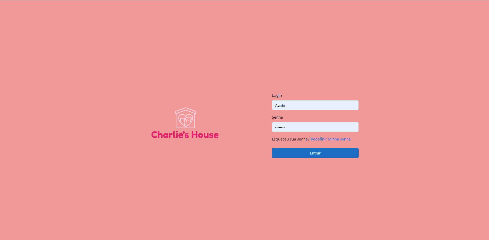
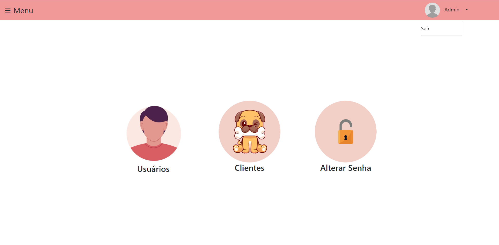
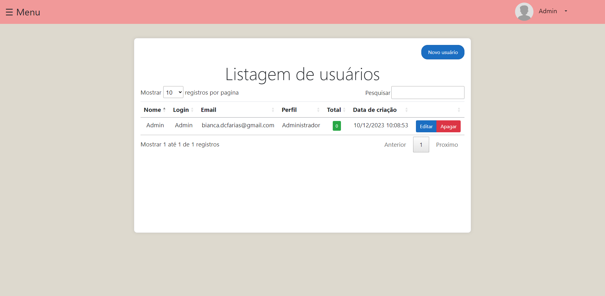
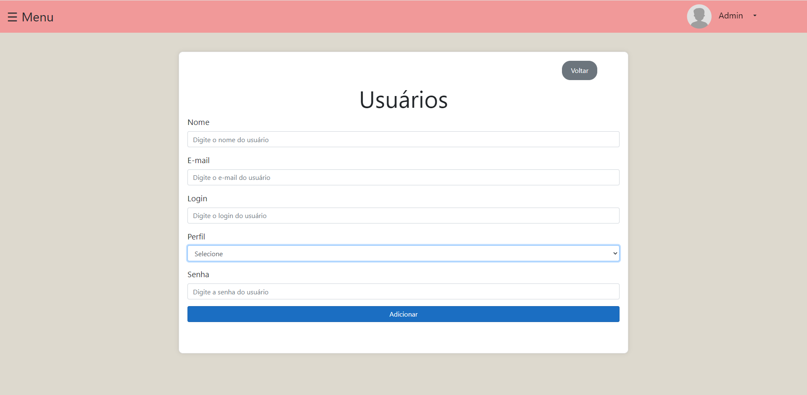
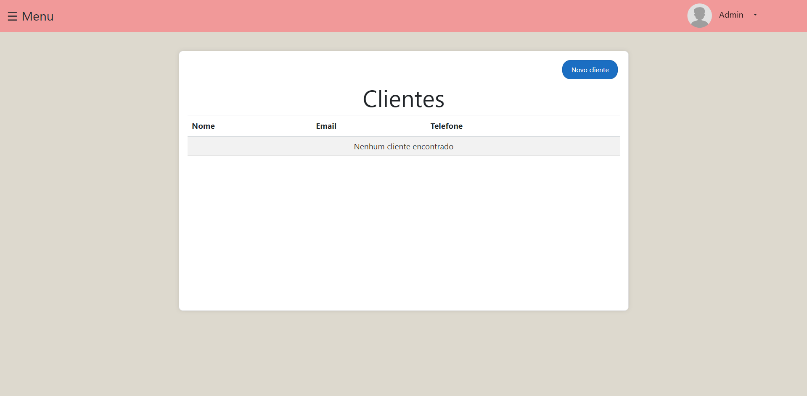
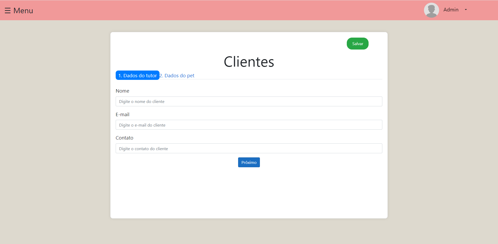
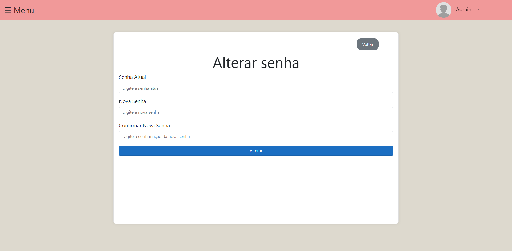

# Charlies House PetShop

Bem-vindo ao repositório do Charlie's House, uma solução web desenvolvida para modernizar e otimizar a gestão de petshops. Este projeto visa proporcionar uma experiência única tanto para os administradores do petshop quanto para os clientes, trazendo facilidades e eficiência no agendamento de serviços, gerenciamento de produtos, e muito mais.

## 🐾 Funcionalidades

Charlie's House Web oferece uma gama de funcionalidades projetadas para simplificar a operação de petshops e melhorar a experiência do cliente:
- Cadastro de Pets: Os clientes podem cadastrar seus pets, facilitando o agendamento de serviços e a personalização do atendimento.
- Cadastro de tutores: Os funcionarios conseguem realizar o cadastro dos tutores, afim de facilitar o contato na prestação dos serviços.

## 📸 Galeria de Telas

*Tela de Login*

*HomePage*

*Lista de usuários*

*Novo usuário*

*Lista de clientes*

*Novo cliente*

*Cadastro de pet*

*Alteração de senha*

